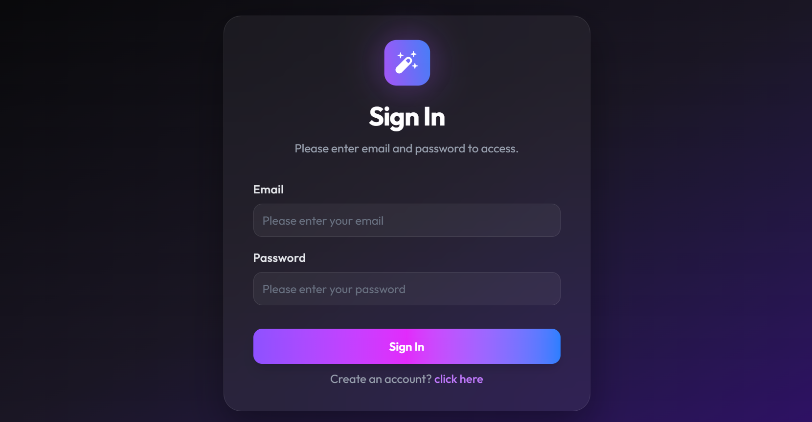
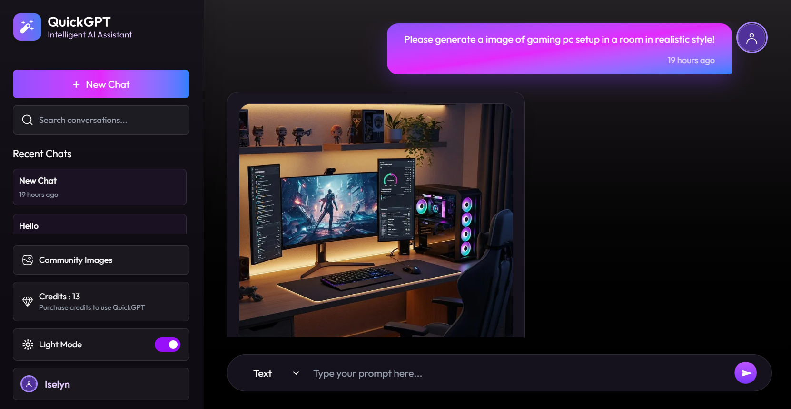
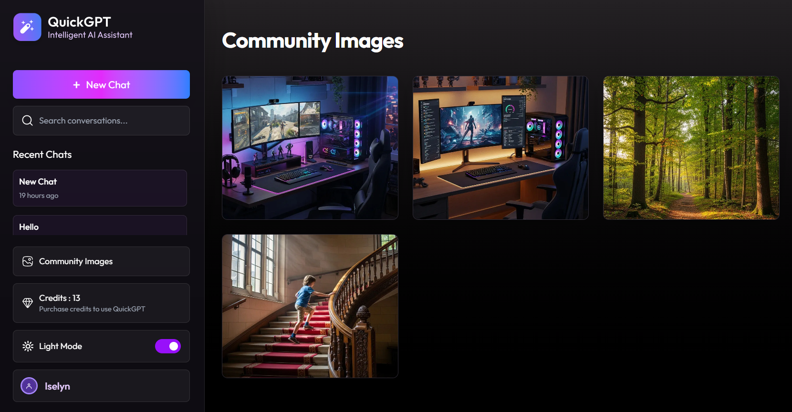

# 🤖 QuickGPT

**QuickGPT** is a full-stack AI chatbot web application built using the **MERN ecosystem**. The application allows authenticated users to interact with an AI assistant through an intuitive chat interface while maintaining conversation history.

The project implements modern web development practices including JWT authentication, RESTful APIs, MongoDB database integration, Markdown rendering, syntax highlighting, and cloud image handling.

---

# 🌐 Live Demo

**Application:** https://quick-gpt-ten-drab.vercel.app/

---

# ✨ Features

## User Authentication

* User registration
* User login
* JWT Authentication
* Password encryption using Bcrypt
* Protected API routes

---

## AI Chat

* Create new conversations
* Send messages to AI
* Receive AI-generated responses
* Chat history
* Delete chat

---

## Markdown Support

* Markdown rendering
* Code block formatting
* Syntax highlighting

---

## User Experience

* Responsive design
* Loading states
* Toast notifications
* Modern UI
* Clean navigation

---

## Cloud Integration

* MongoDB Atlas
* ImageKit
* Google Gemini API

---

# 🛠 Tech Stack

## Frontend

* React 19
* Vite
* Tailwind CSS
* React Router
* Axios
* React Markdown
* PrismJS
* React Hot Toast
* Moment.js

---

## Backend

* Node.js
* Express.js
* MongoDB
* Mongoose
* JWT
* BcryptJS
* Google Gemini API
* ImageKit
* CORS

---

# 📂 Project Structure

```text
QuickGPT
│
├── backend
│   ├── configs
│   ├── controllers
│   ├── middlewares
│   ├── models
│   ├── routes
│   ├── server.js
│   └── package.json
│
├── frontend
│   ├── public
│   ├── src
│   │   ├── assets
│   │   ├── components
│   │   ├── context
│   │   ├── pages
│   │   ├── App.jsx
│   │   ├── Main.jsx
│   │   └── index.css
│   └── package.json
│
└── README.md
```

---

# ⚙ Installation

## Clone Repository

```bash
git clone https://github.com/MFadhliAlHafizh/QuickGPT.git

cd QuickGPT
```

---

## Backend

```bash
cd backend

npm install
```

Start server

```bash
npm run server
```

---

## Frontend

```bash
cd frontend

npm install
```

Start development server

```bash
npm run dev
```

---

# 🔐 Environment Variables

Backend

```env
MONGODB_URI=

JWT_SECRET=

GEMINI_API_KEY=

IMAGEKIT_PUBLIC_KEY=

IMAGEKIT_PRIVATE_KEY=

IMAGEKIT_URL_ENDPOINT=

VITE_BACKEND_URL=
```

---

# 🚀 Running the Project

Open two terminals.

Terminal 1

```bash
cd backend

npm run server
```

Terminal 2

```bash
cd frontend

npm run dev
```

---

# 📡 API Overview

## Authentication

```
POST /api/user/register

POST /api/user/login

POST /api/user/data
```

---

## Chat

```
POST /api/chat/create

GET /api/chat/get

POST /api/chat/:id
```

---

## Message

```
POST /api/message/text

POST /api/message/image
```

---

## Credit

```
GET /api/credit/plan
```

---

# 🎨 UI Highlights

* Responsive Layout
* Modern Design
* AI Conversation Interface
* Markdown Rendering
* Syntax Highlighting
* Toast Notifications
* Loading Animation

---

# 👨‍💻 Author

**Muhammad Fadhli Al Hafizh**

---

# 📄 License

This project is provided for educational and portfolio purposes.

---

# 📸 Pages Overview






